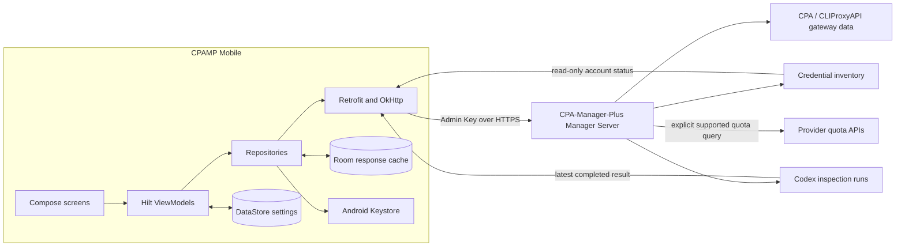

# CPAMP Mobile

`Android 8.0+` · `Kotlin` · `Jetpack Compose` · `Material 3` · `MIT`

CPAMP Mobile is a native Android administration and observability client for a configured CPA-Manager-Plus Manager Server.

**Current version:** `1.3.6`

- 📊 Overview, usage analytics, aggregate monitoring, and account health
- 🔐 Keystore-backed credentials with no telemetry
- 🌐 Simplified Chinese and English

> [!IMPORTANT]
> CPAMP Mobile is an independent, unofficial client. It is not affiliated with, endorsed by, or maintained by Seakee or the [CPA-Manager-Plus](https://github.com/seakee/CPA-Manager-Plus) project. CPA-Manager-Plus names and upstream project references identify interoperability only.

## 🚀 Quick start

1. Install a signed APK from [GitHub Releases](https://github.com/qaz6750/CPAMP-Mobile/releases), or use a release-signed CI Debug APK for preview builds.
2. Enter the base address of an existing full-mode Manager Server, normally `https://your-server:18317`.
3. Authenticate with the **CPAMP Admin Key**, then select the server profile you want to monitor.

Use HTTPS whenever possible. HTTP is available only as an explicitly confirmed compatibility option and exposes credentials to the network.

## Server requirements

CPAMP Mobile requires an already configured CPA-Manager-Plus **full-mode Manager Server**, normally exposed on port `18317`.

- Enter the Manager Server base address, such as `https://manager.example.com:18317`.
- Use the **CPAMP Admin Key** as the login credential. This is not a client API key issued to applications using the gateway.
- The app validates `/status` or `/usage-service/info`, checks the Admin Key, and reads available capabilities before saving a profile.
- CPA lightweight mode, commonly exposed on port `8317`, is detected and reported as unsupported.
- Initial Manager Server setup is not performed by the app.

HTTPS uses the Android system trust store and hostname verification. Certificate failures cannot be bypassed.

## HTTP warning

Arbitrary HTTP addresses are supported only as an explicit compatibility option. HTTP sends the Admin Key and management data without transport encryption. A network observer may read or modify that traffic.

Each HTTP server requires an explicit warning confirmation before first use. The login screen, saved server list, and server management in Settings continue to identify the connection as unencrypted. Local Keystore encryption cannot protect credentials while they travel over HTTP.

## ✨ Features

| Area | Current capabilities |
| --- | --- |
| Servers | Add, validate, delete, and quickly switch full-mode Manager Servers |
| Overview | Health, daily requests, success rate, tokens, estimated cost, interactive token/request trends, and real provider marks |
| Usage | Interactive usage buckets, on-demand rankings, and privacy-safe Today/7-day/30-day share images |
| Accounts | Read-only credential inventory, status, completed-inspection results, and explicitly refreshed provider quota windows |
| Settings | Saved-server management, app lock, screenshot/address privacy, appearance, language, open-source notices, and signed in-app updates |
| Security | Keystore AES-GCM, optional biometric/device-credential app lock, configurable screenshot protection, no backup |
| Appearance | Blue-and-white light theme, charcoal dark theme, Simplified Chinese and English |

Destructive changes show the affected object and require confirmation. Switching servers cancels requests from the previous server and rebuilds screen state so cached data cannot cross profiles.

Overview and Usage request aggregate analytics only and never download request-event pages or request details. Usage computes only the selected ranking, and a share image makes at most one explicit analytics request when the selected range cannot reuse loaded aggregate data.

Accounts reads the Manager Server credential inventory and the latest completed CPAMP inspection from `/v0/management/codex-inspection/runs` and `/v0/management/codex-inspection/runs/{id}`. It never starts an inspection. An explicit refresh can use the Manager Server's authenticated API-call proxy to request quota windows from supported providers; unsupported providers still expose basic read-only account health. Individual provider failures degrade only the affected account. The per-profile fallback cache stores only ordered placeholders and aggregate status/quota data, never account labels, file names, authentication indexes, or raw responses. The app does not create, edit, refresh, disable, or delete providers, authentication files, quota cooldowns, or gateway client API keys. Use the CPA-Manager-Plus web interface for those administrative operations.

## 🧭 Architecture



Room stores only profile-isolated, privacy-safe response data. DataStore holds non-secret application settings and server metadata. Admin Keys remain encrypted by Android Keystore and are attached only to requests for the selected server profile.

Update checks occur only when the user taps **Check for updates**. Releases are read from this repository's public GitHub Releases API with no embedded GitHub token and no Manager Admin Key. The system Download Manager downloads the APK, then the app verifies the published SHA-256 and requires the APK signing certificate to match the installed app before opening the Android installer.

## 🛠️ Build

Prerequisites:

- JDK 17
- Android SDK with API 36 platform and matching build tools
- Android Studio or a command-line Android SDK installation

Create `local.properties` with the SDK path when Gradle cannot discover it automatically:

```properties
sdk.dir=/absolute/path/to/Android/Sdk
```

Build the debug APK:

```bash
./gradlew assembleDebug
```

The APK is written under `app/build/outputs/apk/debug/`.

The complete local verification commands are:

```bash
./gradlew testDebugUnitTest lintDebug assembleDebug assembleRelease
```

Instrumentation tests require an API 26+ emulator or device:

```bash
./gradlew connectedDebugAndroidTest
```

## APK signing

Debug and release builds use the same release signing environment-variable group:

```text
CPAMP_RELEASE_KEYSTORE_PATH
CPAMP_RELEASE_KEYSTORE_PASSWORD
CPAMP_RELEASE_KEY_ALIAS
CPAMP_RELEASE_KEY_PASSWORD
```

When all four values are available, Gradle uses the release keystore for both build types. Debug builds remain debuggable and use the same application ID as release builds, so a release-signed CI Debug APK can upgrade an installed release build. Android still requires matching signing identity and a newer `versionCode`. Keystores, signing properties, and `local.properties` are ignored by Git.

GitHub Actions accepts the following repository secrets:

```text
CPAMP_RELEASE_KEYSTORE_BASE64
CPAMP_RELEASE_KEYSTORE_PASSWORD
CPAMP_RELEASE_KEY_ALIAS
CPAMP_RELEASE_KEY_PASSWORD
```

Generate the `CPAMP_RELEASE_KEYSTORE_BASE64` secret directly from the binary release keystore as a single-line value:

```bash
base64 -w 0 CPMP-Mobile-release.jks
```

```powershell
[Convert]::ToBase64String([IO.File]::ReadAllBytes("CPMP-Mobile-release.jks"))
```

Before saving the secret group, verify that its keystore, store password, and alias belong together:

```bash
keytool -list -keystore '<keystore-file>' -storepass '<keystore-password>'
keytool -list -keystore '<keystore-file>' -storepass '<keystore-password>' -alias '<key-alias>'
```

The debug workflow requires the release secret group on pushes to `main` and manual runs. Pull requests also require the release secret group, then run tests and lint and build a release-signed Debug APK. Because GitHub does not expose repository secrets to workflows from forks, pull requests from forks cannot complete this signed build. Release tags use the same secret group and fail before Gradle if the decoded keystore, password, or alias do not match.

The workflow uploads debug and release APK artifacts. Its release artifact name explicitly includes `signed` or `unsigned`. Pull requests also run GitHub Dependency Review and reject newly introduced high-severity vulnerable dependencies.

Tags matching `v*` create a GitHub Release only when all signing secrets are present. The tag must match `versionName`; the release contains a deterministically named signed APK and its SHA-256 file. Missing or partial signing configuration blocks the release instead of publishing an unsigned installer.

## 🔐 Security and privacy

- Admin Keys are encrypted separately from server metadata with Android Keystore AES-GCM.
- Enabling app lock migrates ciphertext to a user-authenticated Keystore key; disabling it migrates back and removes the obsolete key.
- Admin Keys are not written to Room, DataStore, saved-state Bundles, logs, crash uploads, or backups.
- Monitoring cache is isolated by server profile and stores aggregate summaries only; request-event rows and details are never cached.
- Accounts keeps live account identity only in memory. Its per-profile fallback cache stores placeholder identities and aggregate health/quota values without labels, file names, authentication indexes, or raw provider responses.
- Screenshots and recent-task previews are allowed by default and can be disabled from Settings.
- Shared usage images contain aggregate requests, success rate, tokens, cost, timeline and top-model data only. They exclude server names, addresses, keys, credentials and account labels.
- In-app updates accept only HTTPS assets with fixed release names, a matching SHA-256, and the installed application's signing identity. Android still requires explicit installer confirmation.
- The app includes no telemetry or third-party crash reporting.

See [SECURITY.md](SECURITY.md) for the reporting process and security boundaries.

## Current boundaries

The app does not support lightweight mode, OAuth login flows, provider/auth-file/client-key management, plugin stores, raw YAML editing, model price management, inspection automation, backup migration, usage import/export, or Manager Server initial setup.

## License and attribution

CPAMP Mobile source code is licensed under the [MIT License](LICENSE). Third-party dependency attribution is listed in [THIRD_PARTY_NOTICES.md](THIRD_PARTY_NOTICES.md).

[CPA-Manager-Plus](https://github.com/seakee/CPA-Manager-Plus) is the upstream interoperable server project: "A self-hosted CPA / CLIProxyAPI management panel and AI gateway observability dashboard for requests, usage, cost, quota, failures, and account health." It is available under the MIT License, Copyright (c) 2026 Seakee. CPA-Manager-Plus is not bundled with this application.

Public Manager Server API contracts are implemented independently. The complete upstream MIT notice and provider-mark sources are documented in [THIRD_PARTY_NOTICES.md](THIRD_PARTY_NOTICES.md) and [LICENSE_COMPLIANCE.md](LICENSE_COMPLIANCE.md); the upstream notice is also available offline inside the app.
